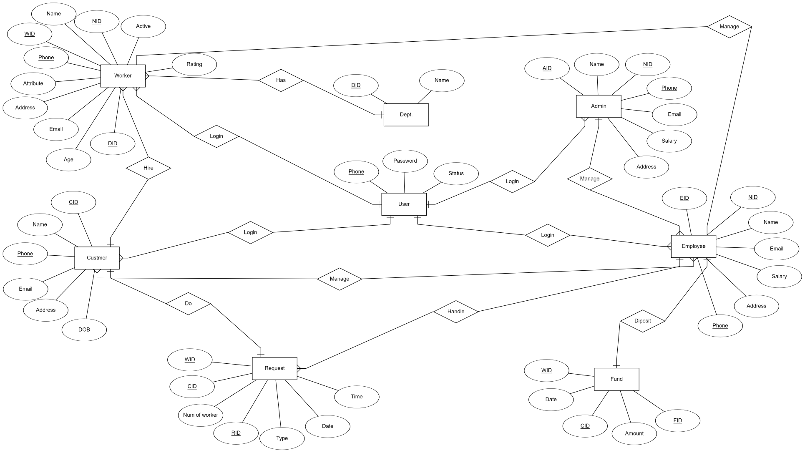
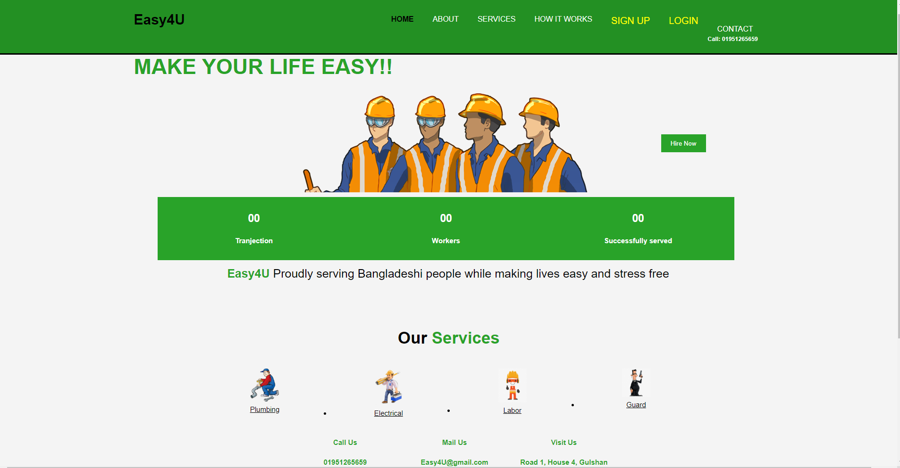
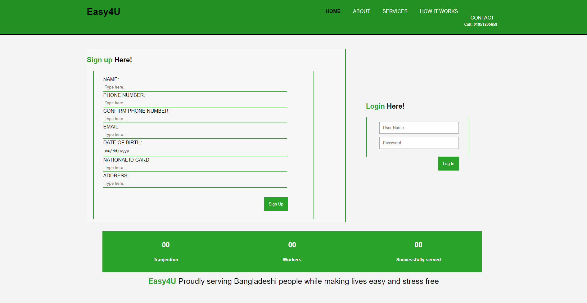
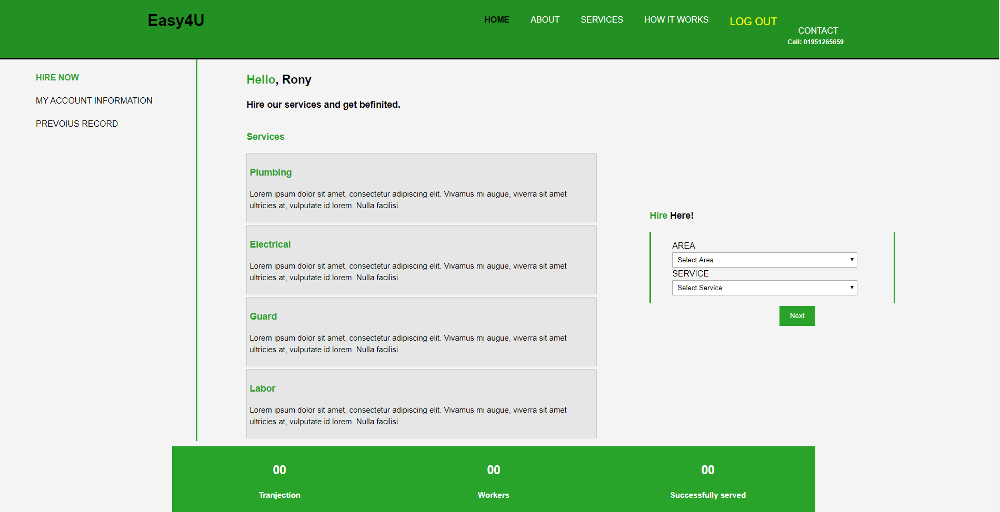
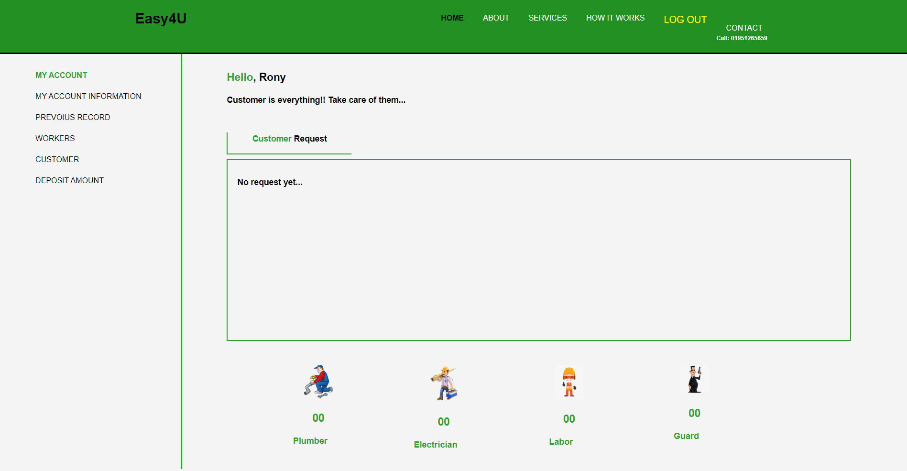
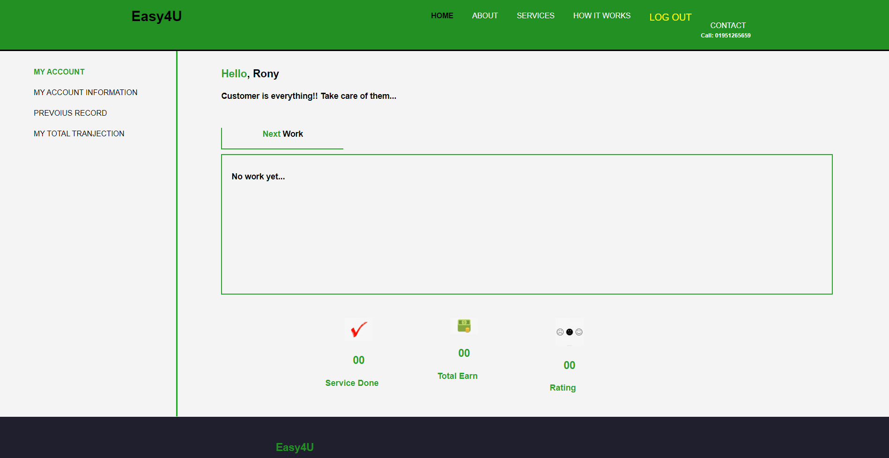

# Online_Worker_service_provider_NodeJs
Prepared a group project on "Online Worker Service Provider" by using NodeJS, which is in our course curriculum under MD. Al-Amin, Lecturer, Computer Science, American International University-Bangladesh (AIUB).

<h3>Introduction:</h3>

In our daily life, we face various types of labor problems, for which we have to rely on manual search most of the time, many times laborers are not available at that moment. Most of this era People want to get what they want at home. The aim of this project is to provide labor whenever customers need it.

<h3>User Category:</h3>

There are 4-types of Users here:

    • Admin   
    • Customer
    • Employee
    • Worker

<h3>Feature List:</h3>

<b>Admin</b>

    • Add new employee. 
    • Delete employee.
    • See All Information Of worker And employee.
    • Add new worker.
    • Delete worker.
    • Add new department.
    • Delete Department.
    • See Transaction.
    • Delete/Block customer account.

<b>Customer</b>

    • Create account.
    • Chose workers department.
    • Sent request. 
    • Select worker quantity.
    • Select suitable payment option. 
    • Select suitable working address.

<b>Employee</b>

    • Add new workers.
    • Delete workers.
    • Manage workers account.
    • Receive customer request.
    • Receive payment.
    • Manage customer account.
   
<b>Worker</b>

    • Can see account information.
    • Update account.
    • Change Status.
    
<h3>Diagram:</h3>

<b>ER Diagram:</b>

</img>

<h3>Used in project</h3>
<b>To develop this project, we have used the following: </b>

    • VS Code. 
    • NodeJS (Express).
    • PHP.
    • CSS.
    • HTML5.
    • MySQL.
    • JavaScript.
    

<h3>System Image:</h3>
    
<b>Landing page:</b>

</img>

    
<b>Sign up & Login page:</b>

</img>

    
<b>Customer page:</b>

</img>

    
<b>Admin & Employee page:</b>

</img>

<b>Worker page:</b>

</img>

<h3>Impact of this project:</h3>

Online service provider systems are new enablers in the online market. Customers have their own needs and employees can find all the ways, methods and resources to meet their needs. With the help of this project, people can easily hire workers and fulfill their needs in a simple way.
